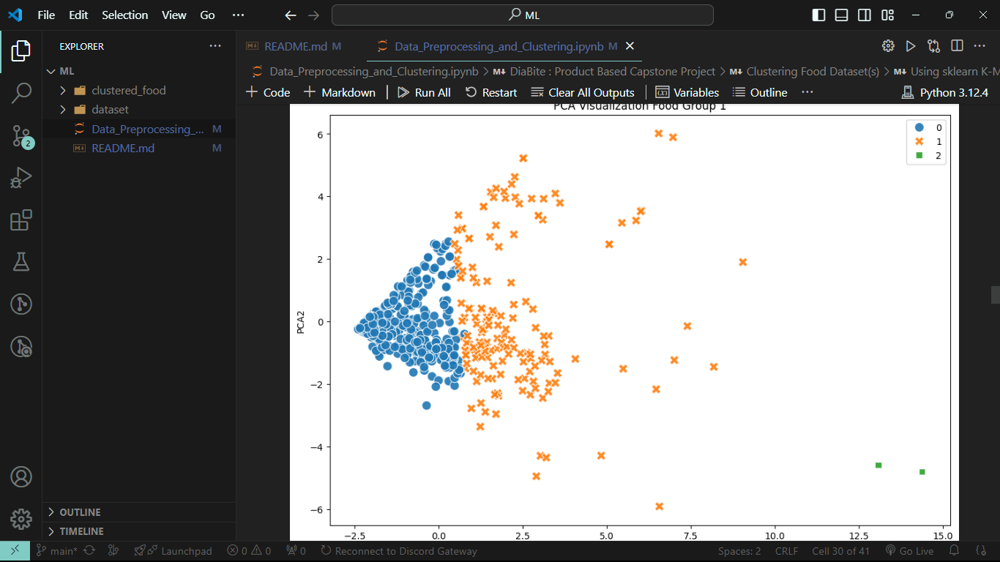
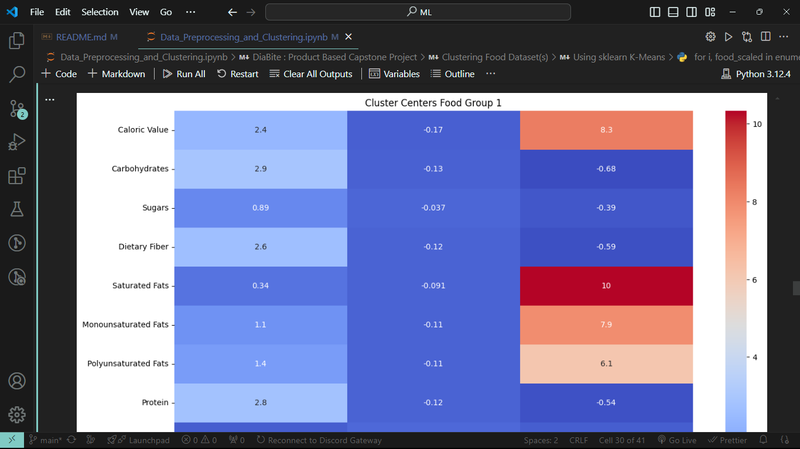

# DiaBite : Machine Learning

## 📑 Description

Coming soon..

## 📚 Related Project Repositories

|    Learning Paths     |                            Link                             |
| :-------------------: | :---------------------------------------------------------: |
|  ☁️ Cloud Computing   | [CC Repository](https://github.com/DiaBite-Bangkit-2024/CC) |
| 📱 Mobile Development | [MD Repository](https://github.com/DiaBite-Bangkit-2024/MD) |

## 🤖 Machine Learning

### Model #1

The diabetes model use relevant features from the dataset to predict the likelihood of diabetes in user using neural network.

### Model #2

The clustering model to make new data of food dataset. This data will used to make the 'Food Suggestion' feature in our app.

## 📚 Libraries Used

This project utilizes several Python libraries for data handling, machine learning, and visualization:

| Library             | Purpose                                                                                 |
| ------------------- | --------------------------------------------------------------------------------------- |
| `pandas`            | Facilitates data manipulation and analysis with data frames.                            |
| `numpy`             | Enables efficient numerical computations and array operations.                          |
| `scikit-learn`      | A machine learning library for training models.                                         |
| `tensorflow`        | An open-source machine learning framework for building and training models.             |
| `keras`             | High-level neural networks API, integrated with TensorFlow for easy model construction. |
| `matplotlib.pyplot` | Used for creating visualizations, plots, and charts in Python.                          |
| `seaborn`           | Used for creating visualizations, plots, and charts in Python.                          |
